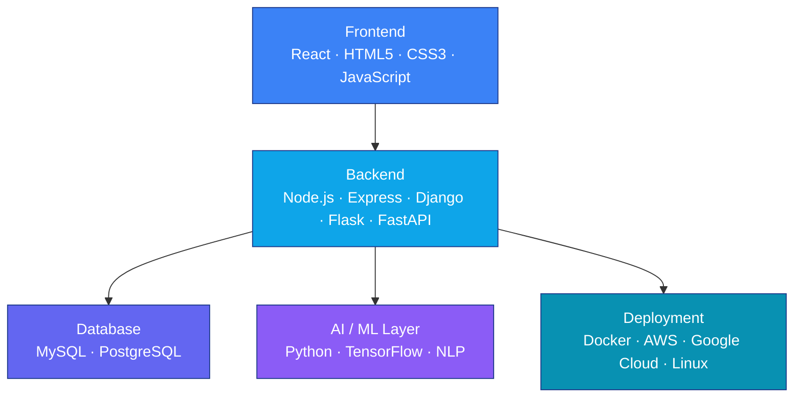
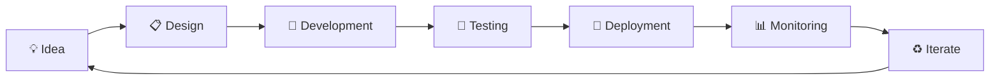
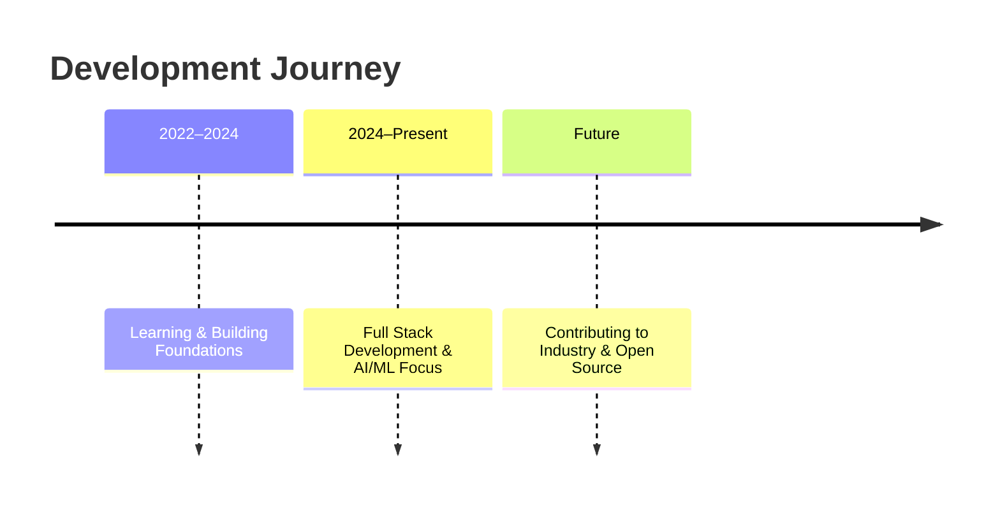

<div align="center">


</div>

---

## 🌟 About Me

I'm a passionate **AI Engineer** and **Full Stack Developer** based in **India**, currently pursuing my **B.Tech in Computer Science** from **KG Reddy Engineering College**. I specialize in building intelligent systems and web applications using cutting-edge technologies. My passion lies in exploring **Artificial Intelligence**, **Machine Learning**, and **Natural Language Processing** to solve real-world problems.

I love training AI models with **Python** and **Java** during my free time and am constantly learning and growing in this ever-evolving tech landscape.

---

## 🎯 Career Goals & Aspirations

🔹 **Goal:** Become a proficient **AI Engineer**
🔹 **Seeking:** **Software Engineer** opportunities to apply my skills in production environments
🔹 **Mission:** Building intelligent, scalable solutions that make a real-world impact

---

## 🧠 Interests

- 🤖 Artificial Intelligence & Machine Learning
- 🔤 Natural Language Processing (NLP)
- ☁️ Cloud Computing
- 🔐 Cybersecurity
- 💻 Full Stack Development

---

## 🛠️ Technical Skills

### Languages
<div align="center">


</div>

### Frontend Development
<div align="center">


</div>

### Backend Development
<div align="center">


</div>

### Databases
<div align="center">


</div>

### AI/ML & Data Science
<div align="center">


</div>

### Tools & Platforms
<div align="center">


</div>

---

## 📊 Skill Proficiency

| Category | Skills | Level |
|----------|--------|-------|
| Languages | Python, Java, JavaScript, SQL | ●●●●● |
| Frontend | React, HTML, CSS, JavaScript | ●●●●○ |
| Backend | Django, Flask, Node.js, Express | ●●●●○ |
| AI/ML | Machine Learning, NLP, TensorFlow | ●●●●● |
| Cloud & Tools | AWS, Google Cloud, Docker, Git | ●●●●○ |
| Databases | MySQL, SQL, Database Design | ●●●●○ |

---

## 🏗️ Tech Stack Architecture



## 🔄 Development Workflow



---

## 🚀 Featured Projects

### AI Resume Screening System


An intelligent system that uses NLP and machine learning to automatically screen resumes and rank candidates based on job requirements.

**Tech Stack:**


**Links:**
- 🔗 [GitHub Repository](https://github.com/reddynikesh83-create/Mini.project)
- 🌐 [Live Demo](https://extraordinary-nasturtium-7b1393.netlify.app)

---

## ⚡ Animated GitHub Highlights

<div align="center">


<br/>


<br/>


</div>

---

## 📊 GitHub Statistics

<div align="center">


[](https://git.io/streak-stats)


</div>

**Contribution Snake Setup**

The snake animation requires a GitHub Action that generates the SVG file. Add the workflow from the `snk` project to your profile repository, then use:

```

```

---

## 💻 Active Development Stats

| Metric | Count |
|--------|-------|
| 📁 Total Repositories | ~15+ |
| ⭐ Total Stars Received | 50+ |
| 🍴 Forks | 25+ |
| 👥 Followers | Growing |
| 💬 Contributions | 200+ |

---

## 🏆 Achievements & Certifications

✅ **SAP Certifications** — Expertise in enterprise resource planning
✅ **Microsoft Certification** — Cloud and development technologies

---

## 📚 Currently Learning

- 🤖 Advanced Artificial Intelligence techniques
- 🔬 Deep learning and Machine Learning frameworks
- 🔤 Advanced Natural Language Processing (NLP) models

---

## 🤝 Open to Collaborate On

- 🤖 AI & ML Projects — Building intelligent systems and models
- 🔬 Research Projects — Exploring cutting-edge technologies
- 🚀 Open Source Contributions — Contributing to the community
- 💡 Innovative Ideas — Turning concepts into reality

---

## 🎓 Education

**B.Tech in Computer Science**
📍 KG Reddy Engineering College, India

---

## 🚀 Quick Links

| Link | Description |
|------|-------------|
| [🌐 GitHub Profile](https://github.com/reddynikesh83-create) | All my repositories & projects |
| [💼 LinkedIn](https://www.linkedin.com/in/b-nikesh-reddy-ab542b423) | Professional networking |
| [📧 Email Me](mailto:reddynikesh83@gmail.com) | Get in touch directly |
| [🚀 AI Resume Project](https://github.com/reddynikesh83-create/Mini.project) | Featured project repository |
| [🌐 Live Demo](https://extraordinary-nasturtium-7b1393.netlify.app) | See the project in action |

---

## 📱 Connect With Me

<div align="center">

[](mailto:reddynikesh83@gmail.com)
[](https://www.linkedin.com/in/b-nikesh-reddy-ab542b423)
[](https://github.com/reddynikesh83-create)

> 💬 *Feel free to reach out! I'm always open to collaborating on exciting projects and discussing innovative ideas.*

</div>

---

## 💡 Fun Fact

I love training AI models with Python and Java during my free time! There's nothing more satisfying than seeing a model learn and improve its accuracy. ☕💻

---

## 📝 Latest Updates

- 🎯 Building intelligent resume screening solutions
- 📖 Mastering NLP and deep learning frameworks
- 🔍 Exploring cloud-based AI deployments
- 🚀 Working on scalable machine learning pipelines

---

## 💪 My Development Journey



---

<div align="center">

### 🌟 If you find my work interesting, don't forget to star my repositories!

### Let's build something amazing together 🚀

*"The only way to do great work is to love what you do." – Steve Jobs*

</div>


